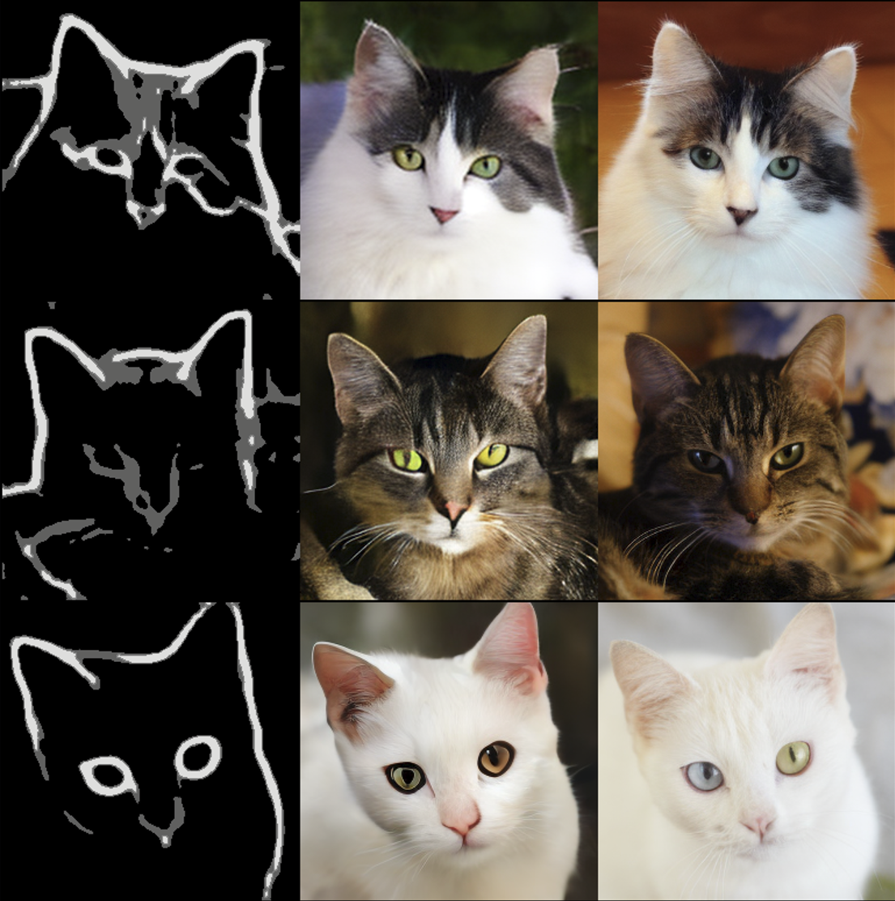
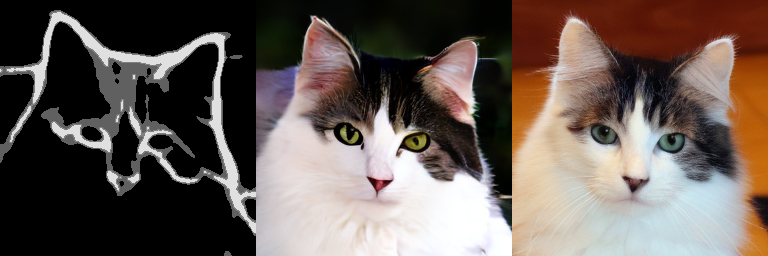
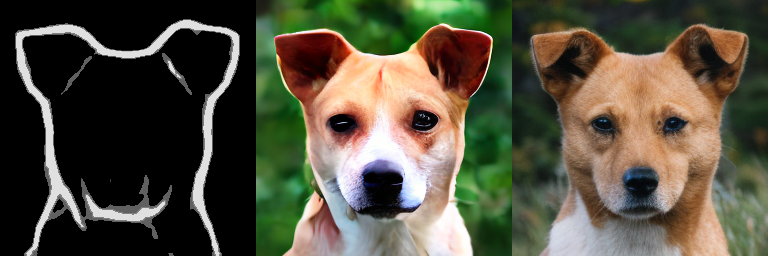
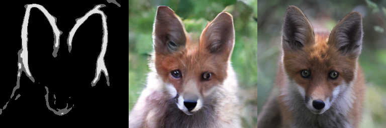

# MeanFlow Edge-to-Image

One-step edge-to-image generation using the MeanFlow framework in VAE latent space.

<p align="center">
  
</p>

<p align="center">
  <em>Figure 1: 1-NFE Generation Results on AFHQ v2. Rows show different samples.<br>Left: Input Edge, Middle: <strong>Generated (1-step)</strong>, Right: Ground Truth.</em>
</p>

This project extends the [MeanFlow](https://arxiv.org/abs/2505.13447) framework from class-conditional generation to **spatial conditioning (Edge-to-Image)**, enabling high-quality image synthesis from edge maps with a single forward pass (1-NFE).

## Features

- **One-Step Generation**: Generate images from edge maps using a single network evaluation

1. **Multi-scale Edge Encoder**
   - Stem: 3× stride-2 conv (256→128→64→32)
   - Multi-scale outputs: 32×32, 16×16, 8×8
   - Zero-init output layers for training stability

2. **Latent U-Net**
   - 3 resolution levels (32→16→8)
   - ResBlocks with ChannelLayerNorm (JVP stability)
   - Self-attention at 8×8 bottleneck
   - Dual time embedding (t, t-r)

3. **MeanFlow Training**
   - JVP-based target computation
   - Adaptive loss weighting
   - Training-time CFG

4. **One-Step Generation**: Generate images from edge maps using a single network evaluation


## 🎨 Qualitative Results

The model demonstrates strong structural alignment with input edges while hallucinating realistic fur textures in a single step.

<p align="center">
  
  
  
</p>

<p align="center">
  <em>High-fidelity samples across categories (Cat / Dog / Wild) generated in <strong>1-NFE</strong>.</em>
</p>


## Project Structure

```
meanflow/
├── src/
│   ├── config.py               # Configuration settings
│   ├── train.py                # Training script
│   ├── inference.py            # Inference & evaluation
│   ├── models/
│   │   ├── unet.py             # U-Net with multi-scale edge encoder
│   │   └── vae.py              # VAE wrapper for SD-VAE
│   ├── utils/
│   │   ├── meanflow.py         # MeanFlow loss & sampling
│   │   └── training.py         # Training utilities (EMA, checkpoints)
│   └── datasets/
│       └── latent_dataset.py
├── tools/
│   ├── preprocess.py           # Dataset preprocessing
│   └── compute_fid_stats.py    # FID statistics computation
├── data/                       # Dataset directory
├── checkpoints/                # Training outputs
└── fid_stats/                  # FID reference statistics
```


## Setup and Installation

### 1. Clone the Repository

```bash
cd <directory-name>
```

### 2. Create a Python Environment

It is highly recommended to use a virtual environment (e.g., `venv` or `conda`) to manage dependencies. This project requires **Python >= 3.10**.

```bash
# Using conda
conda create -n meanflow python=3.10
conda activate meanflow
```

### 3. Install PyTorch

PyTorch installation depends on your system's CUDA version. It is **intentionally excluded** from `requirements.txt` to ensure a correct installation. Please visit the [official PyTorch website](https://pytorch.org/get-started/locally/) to find the appropriate command for your setup.

**Example for CUDA 12.4:**
```bash
conda install mkl==2023.1.0 pytorch==2.5.1 torchvision==0.20.1 torchaudio==2.5.1 pytorch-cuda=12.4 -c pytorch -c nvidia
```

### 4. Install Other Dependencies

Once PyTorch is installed, install the remaining packages (including `pytorch-fid`) using the provided `requirements.txt` file.

```bash
pip install -r requirements.txt
```


## Dataset Preparation

### 1. Download AFHQ v2 Dataset

```bash
# Download AFHQ v2 (Animal Faces HQ)
# Option 1: From official source
wget https://github.com/clovaai/stargan-v2/raw/master/download.sh
bash download.sh afhq-v2-dataset

# Expected structure:
# data/afhq_v2_raw/
# ├── train/
# │   ├── cat/
# │   ├── dog/
# │   └── wild/
# └── test/
#     ├── cat/
#     ├── dog/
#     └── wild/
```

### 2. Preprocess Dataset

The preprocessing script performs:
1. **VAE Encoding**: Encode images to latent space (256×256 → 32×32×4)
2. **PiDiNet Edge Extraction**: Extract semantic edges with Safe Mode quantization

```bash
python -m tools.preprocess \
    --input data/afhq_v2_raw \
    --output data/afhq_v2_processed \
    --image_size 256 \
    --batch_size 32 \
    --num_workers 8
```

**Options:**
| Argument | Default | Description |
|----------|---------|-------------|
| `--input` | Required | Path to raw AFHQ dataset |
| `--output` | Required | Path to save processed data |
| `--image_size` | 256 | Target image size |
| `--batch_size` | 32 | Processing batch size |
| `--num_workers` | 8 | Number of CPU workers |
| `--skip_latent` | False | Skip VAE encoding (edge only) |
| `--save_pngs` | False | Save visualization PNGs |

**Output Structure:**
```
data/afhq_v2_processed/
├── train/
│   ├── cat/
│   │   ├── flickr_cat_000001_latent.pt  # {latent: [4,32,32], edge: [1,256,256]}
│   │   └── ...
│   ├── dog/
│   └── wild/
└── val/
    └── ...
```


## Training

### Basic Training

```bash
python -m src.train --name my_experiment
```

### Resume Training

```bash
python -m src.train --resume checkpoints/my_experiment/models/latest.pt
```

### Custom Data Directory

```bash
python -m src.train --name exp1 --data_dir /path/to/processed_data
```

### Configuration

Key hyperparameters can be modified in `src/config.py`:

```python
CONFIG = {
    "training": {
        "total_epochs": 480,
        "batch_size": 64,
        "accum_steps": 4,        # Effective batch size: 64 × 4 = 256
        "lr": 1e-4,
        "warmup_epochs": 10,
        "ema_decay": 0.999,
        
        # MeanFlow specific
        "boundary_ratio": 0.25,  # Ratio of r=t samples
        "time_dist": "logit_normal",
        "time_mean": -0.4,
        "time_std": 1.0,
        "adaptive_weight_p": 1.0,
        
        # CFG
        "cond_drop_prob": 0.1,   # Condition dropout probability
        "cfg_omega": 2.0,        # Guidance scale
    },
    "model": {
        "base_channels": 128,
        "channel_mults": (1, 2, 4),
        "num_res_blocks": 2,
        "attention_levels": [2],  # Attention at 8×8 resolution
        "dropout": 0.1,
    },
}
```

### Training Outputs

```
checkpoints/my_experiment/
├── config.json                # Saved configuration
├── logs/
│   ├── training.log           # Training log
│   └── metrics.csv            # Epoch-wise metrics
├── images/
│   ├── epoch_0010_ema_s1.png  # Validation samples (1-step)
│   ├── epoch_0010_ema_s2.png  # Validation samples (2-step)
│   └── ...
└── models/
    ├── best.pt                # Best checkpoint (lowest MSE)
    ├── latest.pt              # Latest checkpoint
    └── epoch_0030.pt          # Periodic checkpoints
```

### Monitoring Training

Key metrics to monitor in `metrics.csv`:

| Metric | Description | Ideal |
|--------|-------------|-------|
| `raw_mse` | Mean squared error | ↓ Lower is better |
| `u_pred_rms` | RMS of predicted velocity | Should increase |
| `target_rms` | RMS of target velocity | Reference value |
| `u_pred_rms / target_rms` | Velocity ratio | → 1.0 |


## Hardware & Efficiency

Unlike many diffusion models requiring industrial-grade GPUs, this project is optimized for **consumer hardware**.

| Resource | Specification | Usage Stats |
| :--- | :--- | :--- |
| **GPU** | NVIDIA RTX 4070 | **12GB VRAM** |
| **Training VRAM** | ~11 GB | Batch size 64 (AMP enabled) |
| **Inference Speed** | **< 0.1s / image** | 1-NFE @ 256x256 |
| **Training Time** | ~8 hours* | For 300 epochs |

*\*Estimated time. Thanks to Latent Space training and JVP optimization, MeanFlow converges efficiently on a single card.*


## Inference

### Basic Inference (Grid Visualization)

Generate samples with edge | prediction | ground truth grid:

```bash
python -m src.inference \
    --ckpt checkpoints/my_experiment/models/best.pt \
    --split val \
    --num_samples 20 \
    --steps 1
```

### Compare Sampling Steps

Compare 1-step, 2-step, and 4-step generation:

```bash
python -m src.inference \
    --ckpt checkpoints/my_experiment/models/best.pt \
    --compare_steps
```

Output: `[Edge | GT | 1-step | 2-step | 4-step]` grid

### FID Generation Mode

Generate all validation images for FID calculation:

```bash
python -m src.inference \
    --ckpt checkpoints/my_experiment/models/best.pt \
    --fid \
    --steps 1
```

**Options:**
| Argument | Default | Description |
|----------|---------|-------------|
| `--ckpt` | Required | Path to checkpoint |
| `--split` | val | Dataset split |
| `--category` | all | Category (cat/dog/wild/all) |
| `--num_samples` | 20 | Samples per category |
| `--steps` | 1 | Number of sampling steps |
| `--compare_steps` | False | Compare 1/2/4 steps |
| `--fid` | False | FID generation mode |


## FID Evaluation

### 1. Compute Reference Statistics

First, compute FID statistics for the real images:

```bash
python -m tools.compute_fid_stats \
    --input data/afhq_v2_raw \
    --split test \
    --categories all \
    --image_size 256
```

Output: `fid_stats/afhq_all_val_stats.npz`

### 2. Generate Samples

```bash
python -m src.inference \
    --ckpt checkpoints/my_experiment/models/best.pt \
    --fid \
    --steps 1
```

Output: `checkpoints/my_experiment/results/fid_samples_s1/`

### 3. Calculate FID

```bash
python -m pytorch_fid \
    checkpoints/my_experiment/results/fid_samples_s1 \
    fid_stats/afhq_all_val_stats.npz \
    --device cuda
```


## Performance Analysis

### 1. Quantitative Metrics (FID)

We evaluated the generation quality on the AFHQ v2 validation set. Surprisingly, while more steps improve FID, they degrade perceptual quality (see below).

| Steps (NFE) | FID (↓) | Perceptual Quality |
| :---: | :---: | :--- |
| **1** | **44.06** | **Clean, smooth textures (Best for Visuals)** |
| 2 | 31.59 | Sharper, occasional high-contrast artifacts |
| 4 | 28.64 | **Oversaturated ("Burn" artifacts)** |

### 2. The Multi-Step Paradox

While MeanFlow theoretically supports multi-step integration, we observed a **"Velocity Undershoot"** phenomenon where the learned vector field is conservative.
- **1-Step**: Produces natural, painting-like results.
- **4-Steps**: Forcing multi-step integration on this specific vector field leads to accumulated errors, resulting in high-contrast "burn" artifacts.

**Conclusion**: The model is effectively a specialized **One-Step Solver**.


## Acknowledgments

- [MeanFlow](https://arxiv.org/abs/2505.13447) - Original paper
- [ControlNet](https://github.com/lllyasviel/ControlNet) - Zero-convolution and edge preprocessing insights
- [Stable Diffusion VAE](https://huggingface.co/stabilityai/sd-vae-ft-mse) - Pre-trained VAE
- [AFHQ](https://github.com/clovaai/stargan-v2) - Dataset
